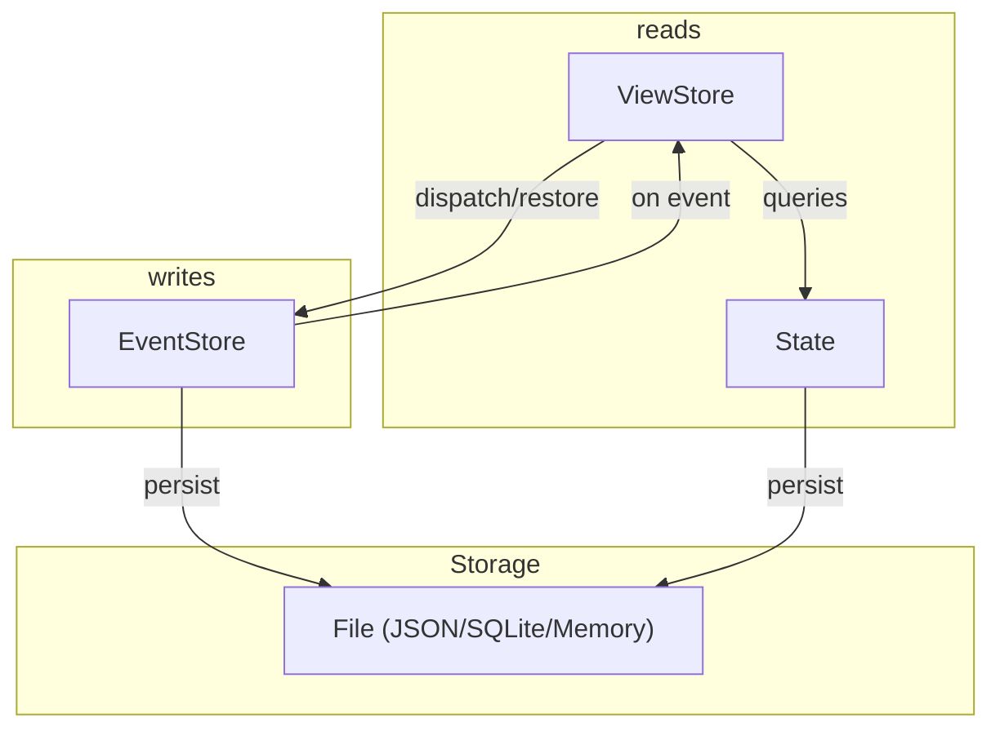

# Event Sourcing Examples (Dart)

This repository demonstrates event sourcing patterns in Flutter using a modular event store and view store architecture. It includes two main example apps:

## Examples

### 1. Counter Example

[example](examples/counter/)

A minimal event-sourced counter app. Features:
- Increment, decrement, and reset actions
- Event history view (see all events that changed the counter)
- Demonstrates how to use the event store and view store for simple state management

### 2. POS (Point of Sale) Example

[example](examples/pos/)

A more advanced example simulating a point-of-sale system. Features:
- Customer and product management
- Inventory tracking
- Order creation, checkout, refund, and restore
- Event history for all actions
- Uses event sourcing to ensure all state changes are event-driven and auditable

### 3. NoSQL Example

[example](examples/nosql/)

A document-oriented event-sourced store. Features:
- Collection and document management (create, update, delete)
- Patch and set operations for document data
- Demonstrates event-driven NoSQL-like storage and querying

### 4. Key-Value (KV) Example

[example](examples/kv/)

A simple key-value event-sourced store. Features:
- Set and delete key-value pairs
- Supports any JSON-serializable value
- Demonstrates minimal event-driven state for key-value use cases

## Architecture

### Event Store

#### Event Store (Write Optimized)

The `EventStore` is responsible for persisting and replaying all events. It provides:
- Methods to add, retrieve, and clear events
- Event processing and streaming
- Support for restoring state to a specific event
- An `onEvent` method to handle each event and update state
- A `restoreToEvent` method to reset and replay events up to a given point

#### View Store (Read Optimized)

The `ViewStore` is a read-optimized store that provides:
- Queries to retrieve current state
- Separation of read and write concerns, allowing for efficient state retrieval without affecting the event store
- Replaying of events to build the current state

This separation allows for robust, testable, and auditable state management in Flutter apps.
